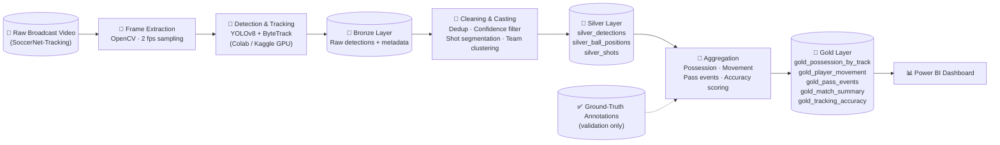

<div align="center">

# ⚽ PitchMapr

### Turning raw broadcast football footage into structured, queryable intelligence

<em>Bronze → Silver → Gold, built on Apache Spark, powered by computer vision</em>

<br/>


</div>

<br/>

## 🧭 Table of Contents

- [Overview](#-overview)
- [Why PitchMapr](#-why-pitchmapr)
- [Key Features](#-key-features)
- [Architecture](#-architecture)
- [Tech Stack](#-tech-stack)
- [Data Source](#-data-source)
- [The Pipeline in Detail](#-the-pipeline-in-detail)
- [Repository Structure](#-repository-structure)
- [Getting Started](#-getting-started)
- [Dashboard](#-dashboard)
- [Validation & Accuracy](#-validation--accuracy)
- [Known Limitations](#-known-limitations)
- [Roadmap](#-roadmap)
- [Acknowledgements](#-acknowledgements)
- [License](#-license)

<br/>

## 🎯 Overview

**PitchMapr** is an end-to-end data engineering pipeline that watches raw broadcast football video and turns it into clean, structured, analyst-ready data — player positions, ball possession, movement patterns, and passing behaviour — without relying on any pre-labelled dataset as its input.

It is built the way a real enterprise analytics platform would be built: distributed processing, a Medallion (Bronze → Silver → Gold) Lakehouse architecture, and a business intelligence layer on top — except the raw feed here isn't a transaction log or an API response, it's video.

> Broadcast cameras film football from a wide, elevated angle. Jersey numbers blur, faces are unreadable, and twenty-two players move continuously across the frame. PitchMapr is the data layer that makes sense of that chaos — frame by frame, at scale.

<br/>

## 🤔 Why PitchMapr

Modern sports analytics platforms already do this at the professional level — tracking every player, every match, in real time. That kind of tooling is normally locked behind expensive vendor contracts and closed data.

PitchMapr is a from-scratch attempt at the same core problem, built entirely on free and open infrastructure: open computer vision models, an open tracking dataset, and free-tier distributed compute. The goal isn't to replace professional-grade tracking systems — it's to prove that the same category of pipeline can be built transparently, and to create a foundation that can grow into a real analytics tool for coaches, analysts, and football content creators.

<br/>

## ✨ Key Features

- 🎥 **Video-native ingestion** — raw broadcast footage as the Bronze-layer data source, not a REST API or a static file dump
- 🧠 **Independent detection & tracking** — a pretrained YOLO model plus ByteTrack assigns persistent identities to every player and the ball, without touching any pre-existing labels
- 🏗️ **True Medallion architecture** — Bronze, Silver, and Gold layers built and transformed in Apache Spark on Databricks
- 🔁 **Realistic ingestion pattern** — a large historical Full Load baseline plus a genuinely incremental stream of newly arriving clips from the same source
- 🕵️ **Built-in validation layer** — pipeline output is scored against an independent ground-truth benchmark, so accuracy is measured, not assumed
- 🔒 **Privacy-conscious by design** — every tracked entity is anonymous; no personally identifying data enters the pipeline at any stage
- 📊 **Business-ready Gold tables** — possession share, player movement, and pass-event data modelled for direct BI consumption
- 📈 **Power BI dashboard** — possession trends, movement heatmaps, and pass networks, out of the box
- 💸 **Zero-cost infrastructure** — runs entirely on free-tier Colab/Kaggle GPUs and Databricks Community Edition

<br/>

## 🏛️ Architecture



<br/>

## 🧰 Tech Stack

| Layer | Tool |
|---|---|
| Video processing |  |
| Object detection |  |
| Multi-object tracking |  |
| GPU compute |   |
| Distributed processing |  |
| Lakehouse platform |  |
| Storage (raw video) |  |
| BI & Dashboards |  |
| Language |  |

<br/>

## 🗂️ Data Source

PitchMapr is built on **[SoccerNet-Tracking](https://www.soccer-net.org)**, an open academic dataset for multi-object tracking in soccer broadcast video. It provides:

- One complete **45-minute broadcast half** — continuous, single-camera footage used as the historical baseline
- A pool of **200 short (30-second) tracking sequences** drawn from 12 different matches — used as a stream of newly available clips
- Ground-truth annotations (tracklets, jersey numbers, team labels, camera-shot boundaries) — used **exclusively for validation**, never as pipeline input

> PitchMapr's detection and tracking stage runs entirely against raw video. Ground-truth labels are reserved for scoring the pipeline's own output after the fact, never for shaping it.

Access to raw SoccerNet video requires a short, free academic non-disclosure agreement via the official site.

<br/>

## 🔬 The Pipeline in Detail

### 🥉 Bronze — Raw Ingestion
Raw video and its metadata, plus unfiltered per-frame detections straight out of YOLO and ByteTrack: frame index, timestamp, a best-guess camera shot, an unvalidated track ID, bounding box, class, and confidence.

### 🥈 Silver — Cleansing
Timestamps, coordinates, and confidence scores are cast to proper types; low-confidence detections are filtered out; duplicate detections in the same frame are removed; the stream is segmented by camera shot, since track identity is only trusted within a single unbroken shot; and players are clustered into teams per match using dominant jersey colour.

| Table | Contents |
|---|---|
| `silver_detections` | One row per detection: frame, shot, track ID, class, bbox, team, confidence |
| `silver_ball_positions` | One row per frame the ball is detected: frame, shot, coordinates, confidence |
| `silver_shots` | One row per camera shot: shot ID, match ID, start/end frame |

### 🥇 Gold — Business-Ready Aggregates

| Table | Purpose |
|---|---|
| `gold_possession_by_track` | Possession percentage per player, per shot/match |
| `gold_player_movement` | Distance covered, average position, time per pitch third |
| `gold_pass_events` | Candidate pass events between tracked players |
| `gold_match_summary` | Match-level possession split, pass count, shot-segment count |
| `gold_tracking_accuracy` | Validation-only table scoring pipeline output against ground truth |

<br/>

## 📁 Repository Structure

```
PitchMapr/
├── README.md
├── requirements.txt
│
├── data/
│   ├── full_load_sample/
│   │   └── detections_full_load_sample.csv
│   └── incremental_load_sample/
│       └── detections_incremental_load_sample.csv
│
├── notebooks/
│   ├── 01_data_acquisition_soccernet.ipynb
│   ├── 02_frame_extraction_opencv.ipynb
│   ├── 03_detection_tracking_yolo_bytetrack.ipynb
│   └── 04_validation_against_groundtruth.ipynb
│
├── databricks/
│   ├── bronze_ingestion.py
│   ├── silver_transformation.py
│   └── gold_aggregation.py
│
├── dashboard/
│   └── PitchMapr_dashboard.pbix
│
└── docs/
    └── technical_blueprint.md
```

<br/>

## 🚀 Getting Started

### 1. Environment setup

```bash
conda create -n pitchmapr python pip
conda activate pitchmapr
pip install -r requirements.txt
```

### 2. Request dataset access

Register for SoccerNet-Tracking access at **[soccer-net.org](https://www.soccer-net.org)**. Approval returns a password used below.

### 3. Download the raw footage (Full Load source)

```python
from SoccerNet.Downloader import SoccerNetDownloader

downloader = SoccerNetDownloader(LocalDirectory="path/to/pitchmapr-data")
downloader.password = input("Password for videos (from the NDA email): ")

# Full Load — raw single-camera broadcast video, including the 45-minute half
downloader.downloadRAWVideo(dataset="SoccerNet-Tracking")
```

### 4. Download validation annotations (benchmark only — never used as pipeline input)

```python
downloader.downloadDataTask(task="tracking-2023", split=["train", "test", "challenge"])
```

### 5. Run detection & tracking

Open `notebooks/03_detection_tracking_yolo_bytetrack.ipynb` in Colab or Kaggle (GPU runtime required) to generate structured detections from raw frames.

### 6. Load into Databricks

Run `bronze_ingestion.py` → `silver_transformation.py` → `gold_aggregation.py` in sequence on Databricks Community Edition.

<br/>

## 📊 Dashboard

The Power BI dashboard connects directly to the Gold layer and answers three core questions:

- 📈 **Possession over time** — which side controlled the match, and when
- 🔥 **Player movement heatmap** — where a given tracked player operated on the pitch
- 🕸️ **Pass network** — how the ball moved between players, visualised as a graph

<br/>

## ✅ Validation & Accuracy

PitchMapr's own detection, tracking, and team-assignment output is checked against SoccerNet's ground-truth annotations for the same footage — not used to build the pipeline, only to grade it. The `gold_tracking_accuracy` table reports how closely PitchMapr's track continuity and team clustering agree with the labelled benchmark, turning "the pipeline works" into a measurable claim.

<br/>

## ⚠️ Known Limitations

- Track identity does not currently persist across camera cuts — each continuous camera shot is tracked independently
- Crowded scenes (free kicks, penalties) can cause brief track ID swaps during heavy occlusion
- Players are represented by anonymous track IDs; jersey-based naming is not yet implemented
- Team assignment is a lightweight per-match colour clustering step, not a trained classifier

<br/>

## 🗺️ Roadmap

- [ ] **Jersey-to-identity matching** — align detected track IDs to real player identities using existing ground-truth jersey numbers as a reference, turning this into a matching problem rather than building OCR from scratch
- [ ] **OCR fallback for unlabelled footage** — extend identity resolution to matches outside SoccerNet using on-demand jersey number recognition
- [ ] **Cross-camera re-identification** — carry track identity across camera cuts using appearance embeddings (jersey colour, body features)
- [ ] **Live video overlay** — render bounding boxes, player labels, and a possession trail directly onto match footage
- [ ] **Expanded event detection** — shots, tackles, offside positioning, and set-piece recognition
- [ ] **Real-time inference mode** — move from batch processing toward near-live analysis for streamed footage
- [ ] **Public-facing app** — package the pipeline behind a lightweight web interface for coaches, analysts, and content creators
- [ ] **Multi-league generalisation** — validate and tune the pipeline across broadcast styles from different leagues and camera setups

<br/>

## 🙏 Acknowledgements

This project uses **[SoccerNet-Tracking](https://www.soccer-net.org)** under its academic and non-commercial research terms. All rights to the underlying broadcast footage remain with their original owners. Full attribution and licence details are maintained by the SoccerNet initiative.

<br/>

## 📜 License

This project is released under the **MIT License**. See [`LICENSE`](./LICENSE) for details. Dataset usage is separately governed by the SoccerNet-Tracking academic licence.

<br/>

<div align="center">

Made with ⚽, ☕, and a lot of frame-by-frame debugging.

</div>
